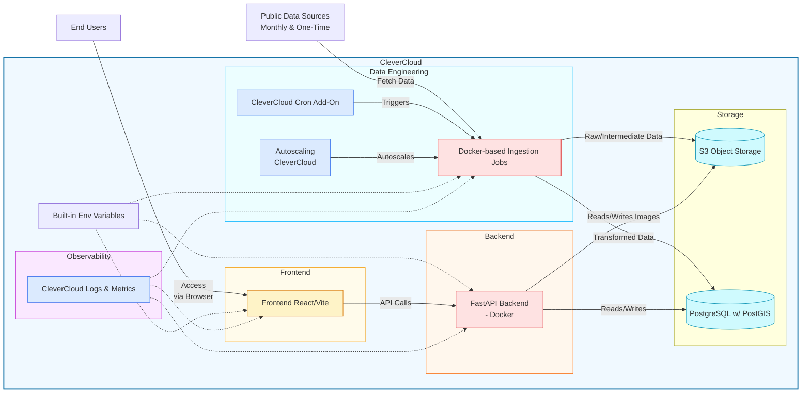

# Brigade des Coupes Rases 🌳

Application de [Canopée](https://www.canopee.ong/) pour détecter, suivre et vérifier les coupes rases abusives en France : les alertes issues de l'imagerie satellite sont chargées dans une base PostGIS, puis des bénévoles les contrôlent sur le terrain via une carte interactive et un formulaire.

Projet [Data For Good](https://dataforgood.fr/), saison 13. Licence MIT.

- [Backend](./backend/README.md) — API FastAPI
- [Frontend](./frontend/README.md) — application React
- [Data pipeline](./data_pipeline/README.md) — ingestion des alertes et des couches de référence
- [Documentation](./doc/README.md) — fiche coupe rase, pipeline, PostGIS
- [Contribuer](./CONTRIBUTING.md) — branches, commits, vérifications avant une pull request

| | |
|---|---|
| Application | <https://app-ab2f14d8-10a9-454d-9a7d-92ab22a54110.cleverapps.io> |
| API | <https://app-5292f305-0563-4fd7-b50a-56f6caf806db.cleverapps.io> (Swagger sur `/docs` en local ; en production seulement si `API_DOCS_ENABLED` est défini) |
| Storybook des composants | <https://dataforgoodfr.github.io/13_brigade_coupes_rases/> |
| Suivi des tâches | [issues GitHub](https://github.com/dataforgoodfr/13_brigade_coupes_rases/issues) |
| Échanges | Slack Data For Good, canal `#13_brigade_coupes_rases` |
| Présentation, comptes rendus | [Outline](https://outline.services.dataforgood.fr/doc/presentation-du-projet-p8g6j1J3ZT) (compte Data For Good) |

## Contexte

La déforestation et les coupes rases illégales représentent une menace majeure pour les écosystèmes et la biodiversité. Il existe cependant un manque de transparence et de contrôle sur ces pratiques, qui rend leur suivi et leur régulation difficiles.

Canopée, association engagée pour la protection des forêts, cherche à automatiser la détection des coupes rases abusives à partir d'un algorithme de surveillance satellite. Les alertes générées doivent être centralisées, analysées et validées ; ce processus était jusqu'ici manuel et fastidieux.

## Objectifs

- Automatiser le traitement des coupes rases détectées par l'algorithme existant (GlobEO).
- Stocker et organiser les informations sur chaque coupe rase détectée.
- Permettre aux bénévoles et aux administrateurs de consulter, compléter et valider ces informations.
- Identifier les coupes rases illégales et produire des statistiques exploitables.
- Optionnellement, répliquer l'identification des coupes rases pour réduire le délai de mise à jour.

## Architecture

1. **Data pipeline** (`data_pipeline/`) : récupère les alertes satellite (GlobEO / SUFOSAT), les regroupe en polygones, les enrichit avec les couches de référence (Natura 2000, BD Forêt, cadastre, pente) et publie le résultat (fichier « gold ») dans le bucket S3. Tourne dans un conteneur Docker.
2. **Base de données** : PostgreSQL avec PostGIS pour les coupes rases et leurs métadonnées spatiales.
3. **Backend** (`backend/`) : API REST FastAPI + SQLAlchemy, avec authentification et rôles (administrateur, bénévole).
4. **Frontend** (`frontend/`) : application React / Vite, carte Leaflet, formulaires de contrôle utilisables hors connexion (PWA).
5. **Stockage objet** : bucket S3 pour les données intermédiaires de la pipeline et les photos des formulaires.

Le tout est hébergé sur [Clever Cloud](https://www.clever-cloud.com/).

Parcours d'une coupe : la pipeline regroupe les détections satellite en **clear cuts**, rattachés à un **signalement** (clear cut report) qui suit un workflow de validation (`to_validate` → `in_progress` → `waiting_for_validation` → `validated` / `legal_validated` / `final_validated`, ou `rejected`). Un administrateur assigne le signalement à un bénévole du département, qui le documente sur place dans un **formulaire** (photos, constat). Les champs de la fiche sont décrits dans [doc/clear-cut-description.md](./doc/clear-cut-description.md), les regroupements dans [doc/pipeline_dataeng.md](./doc/pipeline_dataeng.md).

```
📁 13_brigade_coupes_rases
├── 📁 backend/        API et gestion de la base de données
├── 📁 frontend/       application web (carte, formulaires)
├── 📁 data_pipeline/  collecte et traitement des données
├── 📁 doc/            documentation
├── 📁 docker/         image PostgreSQL/PostGIS de développement (docker-compose.yml à la racine)
└── 📁 keepass/        secrets partagés (chiffrés)
```

<details>
<summary>Diagramme des flux (Mermaid)</summary>



</details>

## Par où commencer ?

Tout ce qui suit fonctionne sans aucun secret, avec un jeu de données de développement. Choisir selon ce que l'on veut modifier :

| Je veux travailler sur… | Prérequis | Commande |
|---|---|---|
| le frontend seul | Node.js 24, pnpm | `pnpm dev:mock` (API simulée par MSW, aucun backend) |
| le frontend avec la vraie API | Docker, Python 3.14, Poetry, Node.js, pnpm | base + backend + `pnpm dev` (ci-dessous) |
| le backend | Docker, Python 3.14, Poetry | base + `make devserver` ; tests avec `make test-unit` puis `make test` |
| la data pipeline | Python 3.14, Poetry | `poetry run pytest` pour les tests ; l'exécution complète demande Docker et les identifiants S3 (voir [Secrets](#secrets)) |
| toute la pile dans Docker | Docker | `./start_docker.sh` : base migrée et peuplée, API sur 8080, frontend sur 8081 |

Comptes du jeu de données de développement : `admin@example.com` / `admin` (administrateur) et `volunteer@example.com` / `volunteer` (bénévole) ; les autres profils sont décrits dans `backend/seed_dev.py`.

## Démarrer en local

Prérequis :

- [Docker](https://docs.docker.com/get-docker/) et Docker Compose ;
- [Python 3.14](https://www.python.org/downloads/) et [Poetry](https://python-poetry.org/docs/#installation) (installation avec pipx recommandée, hors de tout environnement virtuel du projet) pour `backend/` et `data_pipeline/`, chacun avec son propre `pyproject.toml` ;
- [Node.js 24](https://nodejs.org/en) (version dans `frontend/.nvmrc`) et [pnpm](https://pnpm.io/installation) pour `frontend/`.

Chaque README de sous-projet détaille sa propre installation ; ce qui suit est le chemin le plus court.

### Base de données

```bash
docker compose up db pgadmin
```

PostgreSQL écoute sur `localhost:5432` (utilisateur et mot de passe `devuser`, bases `local` et `test`), pgAdmin sur [http://localhost:8888](http://localhost:8888/). Détails et connexion en ligne de commande dans [docker/README.md](./docker/README.md).

### Backend

```bash
cd backend
poetry install
poetry run alembic upgrade head        # créer / mettre à jour les tables
make seed-dev-db                       # jeu de données de développement
make devserver                         # http://localhost:8080/docs
```

### Frontend

```bash
cd frontend
pnpm install
pnpm dev                               # http://localhost:5173, API sur le port 8080
pnpm dev:mock                          # idem sans backend
pnpm build                             # vérification des types + build de production
pnpm test:unit && pnpm test:browser    # tests
```

### Data pipeline

```bash
cd data_pipeline
poetry install
poetry run pytest                      # tests, sans base ni S3
```

L'exécution de la pipeline et le chargement des données historiques (`bootstrap/`) passent par l'image Docker (GDAL) et demandent les identifiants S3 : voir [data_pipeline/README.md](./data_pipeline/README.md).

## Secrets

Rien n'est nécessaire pour développer le frontend ou le backend en local. Les secrets servent à :

- la data pipeline (bucket S3 Scaleway : données brutes, couches de référence, fichiers gold) ;
- l'envoi des photos des formulaires vers S3 (sans S3, le backend les stocke localement) ;
- le déploiement (Clever Cloud), la synchronisation Airtable et les actions manuelles sur les bases de dev et de prod (secrets du dépôt GitHub).

Ils sont dans la [base KeePass](./keepass/secrets.kdbx) du dépôt ([installer KeePass](https://keepass.info/index.html)) ; le mot de passe s'obtient auprès des responsables sur le canal Slack. Cette base est la source de vérité : tout secret utilisé par le projet (comptes cloud, CI/CD, clés d'API, chaînes de connexion…) doit y être référencé.

## Déploiement et opérations

### Branches et déploiement

Les pull requests visent `main`. Fusionner n'entraîne aucun déploiement : la mise en production se fait en publiant une [release GitHub](https://github.com/dataforgoodfr/13_brigade_coupes_rases/releases/new) avec un tag `vX.Y.Z` (bouton « Generate release notes » pour lister les pull requests fusionnées). Le workflow **Release** déploie alors le backend et le frontend sur Clever Cloud. Une release marquée « pre-release » n'est pas déployée.

Pour revenir à une version antérieure, lancer le workflow Release à la main (onglet Actions, « Run workflow ») en indiquant le tag à redéployer.

Le Storybook est publié sur GitHub Pages à chaque modification du frontend sur `main`.

La data pipeline est une application Docker distincte sur Clever Cloud (`CC_DOCKERFILE=data_pipeline/Dockerfile`, contexte de build à la racine du dépôt) ; aucun workflow ne la déploie, elle se met à jour depuis la console Clever Cloud. La synchronisation Airtable tourne dans GitHub Actions (`airtable-sync.yml`, deux fois par jour).

Les workflows peuvent aussi être lancés à la main depuis l'onglet Actions (bouton « Run workflow »).

**Backend CI** : tests du backend (pytest, mypy).


**Frontend CI** : lint, tests unitaires et navigateur (Playwright).


**Database Actions** : actions manuelles sur la base (upgrade, setup, reset).


### Bucket S3

```bash
# Lister les fichiers
aws s3 ls s3://brigade-coupe-rase-s3 --recursive --profile d4g-s13-brigade-coupes-rases

# Supprimer les fichiers de développement
aws s3 rm s3://brigade-coupe-rase-s3/development/reports/ --recursive --profile d4g-s13-brigade-coupes-rases

# Mettre à jour la configuration CORS (fichier dans frontend/s3cors.json)
aws s3api put-bucket-cors --bucket brigade-coupe-rase-s3 --cors-configuration file://frontend/s3cors.json --profile d4g-s13-brigade-coupes-rases
```
