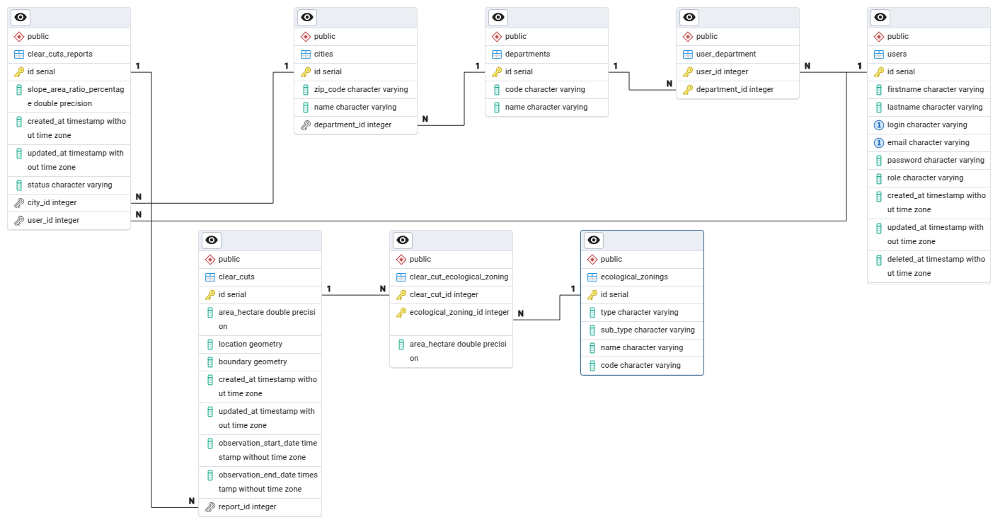

# Brigade Coupes Rases backend

FastAPI + SQLAlchemy API on top of PostgreSQL/PostGIS. Listens on port **8080**.

## Data

All coordinates returned from the API follow this format: latitude/longitude.

## Development

### Prerequisites

- Python 3.13 and [Poetry](https://python-poetry.org/docs/#installation)
- A running PostgreSQL/PostGIS database: `docker compose up db pgadmin` from the
  repository root (creates the `local` and `test` databases, see
  [docker/README.md](../docker/README.md)).

### Installation

```bash
cd backend
poetry install                 # runtime (group "backend") and dev dependencies
poetry run alembic upgrade head
make seed-dev-db               # admin@example.com / admin, volunteer@example.com / volunteer
make devserver                 # http://localhost:8080/docs
```

`make help` lists the other targets (`generate-migration`, `reset-db`,
`seed-prd-db`, …).

### Alternative: Docker

From the repository root, `docker compose up` (or `./start_docker.sh`, which
also migrates and seeds the database) starts the database, the backend on port
8080 and the frontend on port 8081.

VS Code users can open `backend/` in the devcontainer (`.devcontainer/`,
extension `ms-vscode-remote.remote-containers`); it reuses the `backend` service
of `docker-compose.yml`.

### Run the tests

```bash
make test-unit    # unit tests only (test/unit/), no database needed
make upgrade-test-db && make test    # all tests with coverage, needs the migrated test database
```

`test/unit/` holds tests that run without a database (pure functions, schemas,
tokens). Everything else uses the `db` fixture, which migrates and seeds the
test database. Coverage settings are in `pyproject.toml` (`[tool.coverage.*]`).

### Type check

```bash
make typecheck    # mypy, scope defined in pyproject.toml ([tool.mypy])
```

### Add a new backend package

```bash
poetry add package-name --group backend
```

### Use the API

Once the server is running, the API is at `http://localhost:8080` and the
OpenAPI docs, generated from the code, at `http://localhost:8080/docs`.

### Environment variables

Settings are read by `app/config.py` from `.env` if it exists, otherwise from
`.env.test` when `ENVIRONMENT=test`, otherwise from `.env.development`.

| Variable | Required | Description |
|---|---|---|
| `DATABASE_URL` | yes | PostgreSQL connection string |
| `ENVIRONMENT` | yes | `development`, `test` or `production` |
| `PORT` | yes | HTTP port |
| `JWT_SECRET_KEY` | yes | Key used to sign the access, refresh and password-reset tokens |
| `ALLOWED_ORIGINS` | no | Comma-separated origins allowed for CORS |
| `IMPORTS_TOKEN` | no | Token expected in the `x-imports-token` header by the report import endpoint |
| `S3_ACCESS_KEY_ID`, `S3_SECRET_ACCESS_KEY`, `S3_BUCKET_NAME`, `S3_PREFIX`, `S3_REGION`, `S3_ENDPOINT` | no | Object storage for the form photos; without them uploads are stored locally |

`.env.development` and `.env.test` are committed with values for a local
database only. Production values are set on Clever Cloud and referenced in the
shared KeePass database.

### Clever Cloud

- Application: [https://app-5292f305-0563-4fd7-b50a-56f6caf806db.cleverapps.io/](https://app-5292f305-0563-4fd7-b50a-56f6caf806db.cleverapps.io/)
- Swagger UI: [https://app-5292f305-0563-4fd7-b50a-56f6caf806db.cleverapps.io/docs](https://app-5292f305-0563-4fd7-b50a-56f6caf806db.cleverapps.io/docs)
- Database: PostgreSQL add-on, connection string in the KeePass database.

Deployment is triggered by publishing a GitHub release, see the
[main README](../README.md#branches-et-déploiement).

## Database schema


