```mermaid
erDiagram
    WATER_COURSE{
        char(36)        id                      PK
        varchar(n)      code                    
        varchar(n)      codeOrigin                    
        path            course           
    }
    WATER_COURSE_REPORTING{
        char(36)        reporting_id            PK, FK
        char(36)        water_course_id         PK, FK
    } 
    WATER_ZONE{
        char(36)        id                      PK
        varchar(n)      code                    
        varchar(n)      codeOrigin                    
        polygon         area           
    }
    WATER_ZONE_REPORTING{
        char(36)        reporting_id            PK, FK
        char(36)        water_zone_id         PK, FK
    } 
    ECOLOGICAL_ZONING{
        char(36)        id                      PK
        varchar(n)      name                     
    }
    ECOLOGICAL_ZONE{
        char(36)        id                      PK
        varchar(n)      code                    
        varchar(n)      name                    
        polygon         area
        char(36)        ecological_zoning_id    FK
    }
    CITY{
        char(36)        id                      PK
		varchar(n)      name
        char(5)         postalCode
		char(36)        department_id           FK
    }
    DEPARTMENT{
        char(36)        id                      PK
		varchar(n)      name
    }
    CADASTRAL_PARCEL{
        char(36)        id                      PK
        varchar(n)      code
        real            areaMeters
        polygon         area
        char(36)        city_id                 FK
    }

    CADASTRAL_PARCEL_REPORTING{
        char(36)        reporting_id            PK, FK
        char(36)        cadastral_parcel_id     PK, FK
    } 
    
    ECOLOGICAL_ZONING_REPORTING{
        char(36)        reporting_id            PK, FK
        char(36)        ecological_zoning_id    PK, FK
    } 
    REPORTING{
        char(36)        id                      PK
        timestamp       cut_date                
        real            slope_percentage        
        point           center
        polygon         area
        enum            status
        char(36)        department_id           FK
        NULL_char(36)   user_id                 FK              
    }

    REPORTING_WATER_COURSE{
        char(36)        reporting_id            PK,FK
        char(36)        water_course_id         PK,FK
    }
    REPORTING_WATER_ZONE{
        char(36)        reporting_id            PK,FK
        char(36)        water_zone_id           PK,FK
    }

    REPORTING_VERSION{
        char(36)        id
        timestamp       createdAt
        char(36)        user_id                 FK
        char(36)        reporting_id            FK
    }

    USER{
        char(36)        id                      PK
        createdAt       timestamp
        deletedAt       timestamp
        bool            invitationConfirmed
        varchar(n)      login
        varchar(n)      email
        varchar(n)      password
        varchar(n)      firstname
        varchar(n)      lastname
        enum            role
    }

    USER_DEPARTMENT{
        char(36)        user_id                 FK
        char(36)        department_id           FK
    }

    PICTURE{
        char(36)        id
        varchar(n)      url
    }

    REPORTING_VERSION_PICTURE{
        char(36)        reporting_version_id    FK
        char(36)        picture_id              FK
        enum            type
    }

    VALIDATION_PARAMETERS{
        real maxRegularSlopePercentage
        real maxRegularCutSize
    }


    ECOLOGICAL_ZONING   ||--o{ ECOLOGICAL_ZONE              : located
    DEPARTMENT          ||--|{ CITY                         : group
    CADASTRAL_PARCEL    }|--|| CITY                         : located
    CADASTRAL_PARCEL    ||--o{ CADASTRAL_PARCEL_REPORTING   : linked
    REPORTING           ||--o{ CADASTRAL_PARCEL_REPORTING   : linked
    ECOLOGICAL_ZONING   ||--o{ ECOLOGICAL_ZONING_REPORTING  : linked
    REPORTING           ||--o{ ECOLOGICAL_ZONING_REPORTING  : linked
    WATER_COURSE        ||--o{ WATER_COURSE_REPORTING       : linked
    REPORTING           ||--o{ WATER_COURSE_REPORTING       : linked
    WATER_ZONE          ||--o{ WATER_ZONE_REPORTING         : linked
    REPORTING           ||--o{ WATER_ZONE_REPORTING         : linked
    PICTURE             ||--o{ REPORTING_VERSION_PICTURE    : describe
    REPORTING_VERSION   ||--o{ REPORTING_VERSION_PICTURE    : describe
    REPORTING_VERSION   }o--|| USER                         : edited
    REPORTING           }o--o| USER                         : edited
    USER                ||--o{ USER_DEPARTMENT              : allowed
    DEPARTMENT          ||--o{ USER_DEPARTMENT              : allowed
    
```

# Explanations 

## Versioning
Reporting is generated automatically, for each changes from user a reporting version is created

## Map data
Tables ECOLOGICAL_ZONE, ECOLOGICAL_ZONING, WATER_COURSE, CADASTRAL_PARCEL, WATER_ZONE are used to display layers on the map, and to filters reporting (WATER_COURSE, WATER_ZONE, ECOLOGICAL_ZONE, ECOLOGICAL_ZONING).

## Pictures 
Table picture store picture urls, REPORTING_VERSION_PICTURE qualify a relation between a picture and a version of reporting. Type column in the table classify kind of picture related to reporting version. 

## Department
A reporting is located in a department, users can filter reportings by departments. Volunteers are affected to departments.
If a reporting is located on multiple departments, the most overlapping department is assigned.

## RGPD
Users can be deleted, when there are deleted we should erase there firstname, lastname, password. They are kept in database to versioning purpose, to identify them we keep the login and email. 

## Manual reporting version fields edition
There are extra fields edited by user in the REPORTING_VERSION table but it's not necessary to specify them in the model for now... If the model is validated we have to add them. 
