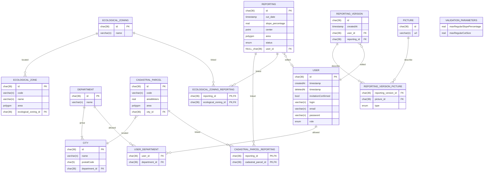

```mermaid
erDiagram
    ECOLOGICAL_ZONING{
        char(36)        id                      PK
        varchar(n)      name                     
    }
    ECOLOGICAL_ZONE{
        char(36)        id                      PK
        varchar(n)      code                    
        varchar(n)      name                    
        polygon         area
        char(36)        ecological_zoning_id    FK
    }
    CITY{
        char(36)        id                      PK
		varchar(n)      name
        char(5)         postalCode
		char(36)        department_id           FK
    }
    DEPARTMENT{
        char(36)        id                      PK
		varchar(n)      name
    }
    CADASTRAL_PARCEL{
        char(36)        id                      PK
        varchar(n)      code
        real            areaMeters
        polygon         area
        char(36)        city_id                 FK
    }

    CADASTRAL_PARCEL_REPORTING{
        char(36)        reporting_id            PK, FK
        char(36)        cadastral_parcel_id     PK, FK
    } 
    
    ECOLOGICAL_ZONING_REPORTING{
        char(36)        reporting_id            PK, FK
        char(36)        ecological_zoning_id    PK, FK
    } 
    REPORTING{
        char(36)        id                      PK
        timestamp       cut_date                
        real            slope_percentage        
        point           center
        polygon         area
        enum            status
        NULL_char(36)   user_id                 FK              
    }

    REPORTING_VERSION{
        char(36)        id
        timestamp       createdAt
        char(36)        user_id                 FK
        char(36)        reporting_id            FK
    }

    USER{
        char(36)        id                      PK
        createdAt       timestamp
        deletedAt       timestamp
        bool            invitationConfirmed
        varchar(n)      login
        varchar(n)      email
        varchar(n)      password
        enum            role
    }

    USER_DEPARTMENT{
        char(36)        user_id                 FK
        char(36)        department_id           FK
    }

    PICTURE{
        char(36)        id
        varchar(n)      url
    }

    REPORTING_VERSION_PICTURE{
        char(36)        reporting_version_id    FK
        char(36)        picture_id              FK
        enum            type
    }

    VALIDATION_PARAMETERS{
        real maxRegularSlopePercentage
        real maxRegularCutSize
    }


    ECOLOGICAL_ZONING   ||--o{ ECOLOGICAL_ZONE              : located
    DEPARTMENT          ||--|{ CITY                         : group
    CADASTRAL_PARCEL    }|--|| CITY                         : located
    CADASTRAL_PARCEL    ||--o{ CADASTRAL_PARCEL_REPORTING   : linked
    REPORTING           ||--o{ CADASTRAL_PARCEL_REPORTING   : linked
    ECOLOGICAL_ZONING   ||--o{ ECOLOGICAL_ZONING_REPORTING  : linked
    REPORTING           ||--o{ ECOLOGICAL_ZONING_REPORTING  : linked
    PICTURE             ||--o{ REPORTING_VERSION_PICTURE    : describe
    REPORTING_VERSION   ||--o{ REPORTING_VERSION_PICTURE    : describe
    REPORTING_VERSION   }o--|| USER                         : edited
    REPORTING           }o--o| USER                         : edited
    USER                ||--o{ USER_DEPARTMENT              : allowed
    DEPARTMENT          ||--o{ USER_DEPARTMENT              : allowed
    
```
