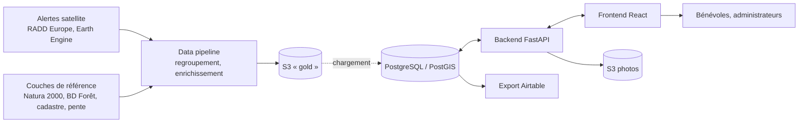
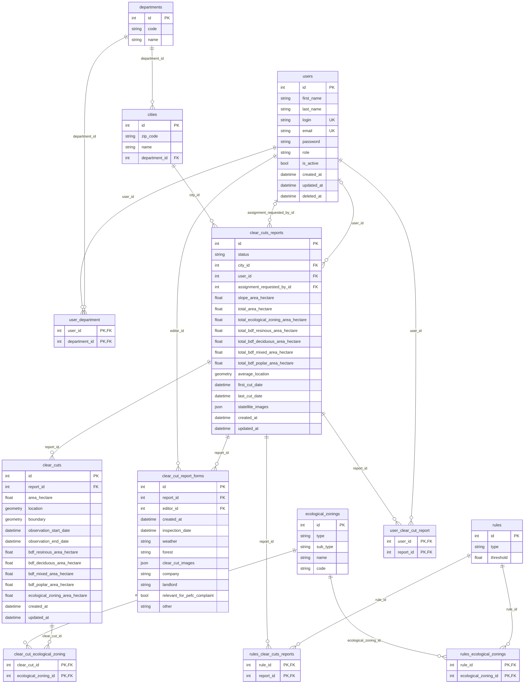
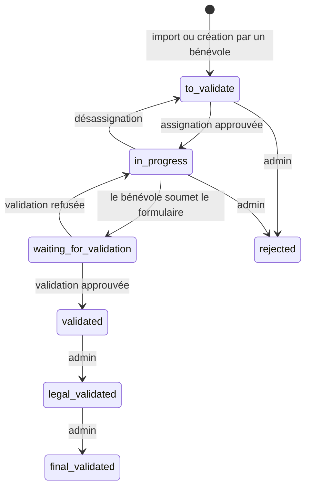

# Architecture et domaine métier

Ce document décrit ce qu'il faut connaître avant de modifier le code, quel que soit le sous-projet : le vocabulaire, le modèle de données, le cycle de vie d'un signalement, les rôles, puis l'organisation du backend et du frontend. Pour installer et lancer le projet, voir le [README](../README.md).

## Vue d'ensemble

- La **data pipeline** ne connaît que les coupes : elle lit la base pour savoir jusqu'où elle a déjà traité, et publie ses résultats dans S3 ([data_pipeline/pipeline/README.md](../data_pipeline/pipeline/README.md)).
- Le **backend** possède la base : modèles, migrations, règles d'illégalité, workflow, authentification.
- Le **frontend** est une SPA qui ne parle qu'à l'API ; il fonctionne aussi sur des données simulées (`pnpm dev:mock`).

## Glossaire

| Terme | Dans le code | Définition |
|---|---|---|
| Polygone | — (pipeline) | Une détection satellite unitaire, datée. Plusieurs millions depuis 2018 ; jamais stockés en base. |
| Coupe rase, *clear cut* | `ClearCut`, table `clear_cuts` | Regroupement de polygones proches dans l'espace (< 100 m) et dans le temps (< 1 an). Porte la géométrie, la surface, les dates d'observation et les surfaces par type de forêt (BD Forêt) et en zonage écologique. |
| Signalement, *clear cut report* | `ClearCutReport`, table `clear_cuts_reports` | Entité suivie par les bénévoles : une ou plusieurs coupes rases, une commune, un statut, un bénévole assigné. Les totaux (surface, dates, localisation moyenne) sont recalculés à partir des coupes. |
| Formulaire, *form* | `ClearCutForm`, table `clear_cut_report_forms` | Constat de terrain rempli par un bénévole pour un signalement. Chaque enregistrement est une **version** : l'historique est conservé, la dernière fait foi. Champs décrits dans [clear-cut-description.md](./clear-cut-description.md). |
| Zonage écologique | `EcologicalZoning` | Zone protégée (Natura 2000…) intersectant une coupe. |
| Règle | `Rules` | Seuil au-delà duquel un signalement est suspect : surface, pente, zonage écologique. |
| Département, commune | `Department`, `City` | Référentiel géographique ; un bénévole est rattaché à un ou plusieurs départements. |

Les regroupements et leur datation sont détaillés dans [pipeline_dataeng.md](./pipeline_dataeng.md).

## Modèle de données

Diagramme généré depuis `backend/app/models.py` avec `make erd` dans `backend/` ; le régénérer après une migration. La table des formulaires est abrégée.

Toutes les géométries sont en WGS 84 (SRID 4326) ; l'API expose les coordonnées en `latitude/longitude`. Voir [intro-to-postgis.md](./intro-to-postgis.md).

### Règles d'illégalité

Trois règles, une ligne chacune dans `rules`, modifiables par un administrateur (page Administration) :

| Type | Un signalement est marqué si… | Seuil initial |
|---|---|---|
| `area` | sa surface totale ≥ seuil (hectares) | 10 |
| `slope` | sa surface en forte pente ≥ seuil (hectares) | 2 |
| `ecological_zoning` | sa surface dans l'un des zonages sélectionnés ≥ seuil (hectares) | 0,5 |

Les règles déclenchées sont stockées dans `rules_clear_cuts_reports` par `sync_clear_cuts_reports` (`backend/app/services/clear_cut_report.py`), qui recalcule aussi les totaux de chaque signalement à partir de ses coupes. Cette synchronisation tourne après le seed et après tout changement de règle.

## Cycle de vie d'un signalement

| Statut | Libellé | Sens |
|---|---|---|
| `to_validate` | À valider | Nouveau, personne d'assigné. |
| `in_progress` | En traitement | Un bénévole est assigné et remplit le formulaire. |
| `waiting_for_validation` | En attente de validation | Le bénévole a terminé ; un administrateur doit relire. |
| `validated`, `legal_validated`, `final_validated` | Validé, validé juridiquement, validé définitivement | Étapes de validation par les administrateurs. |
| `rejected` | Rejeté | Faux positif ou sans suite. |

Les transitions « bénévole » passent par des routes dédiées (`request-assignment`, `validate`, …) ; un administrateur peut aussi fixer n'importe quel statut via `PUT /api/v1/clear-cuts-reports/{id}`. Le formulaire est **verrouillé pour les bénévoles** à partir de `waiting_for_validation` ; un administrateur peut toujours l'éditer.

### Assignation

Un bénévole ne s'assigne pas lui-même : il **demande** l'assignation (`assignment_requested_by_id`), qu'un administrateur approuve ou refuse depuis l'onglet « Actions requises ». En attendant, il peut déjà remplir le formulaire. Un bénévole peut aussi **créer** un signalement depuis la carte (polygone dessiné) : il naît en `to_validate` avec la demande d'assignation déjà posée.

### Versions du formulaire et conflits

Chaque enregistrement (`POST /{id}/forms`) crée une nouvelle version. Le client envoie l'ETag de la version qu'il a chargée ; si le serveur en a une plus récente, il répond `409 ETAG_MISMATCH` et le frontend propose de comparer `original` (version chargée), `current` (édition locale) et `latest` (serveur). Le brouillon est conservé dans `localStorage` pour reprendre l'édition hors connexion.

## Rôles

| | Bénévole (`volunteer`) | Administrateur (`admin`) |
|---|---|---|
| Voir la carte et les signalements | oui | oui |
| Demander une assignation, se désassigner | ses signalements | tous |
| Remplir le formulaire | si assigné et statut non verrouillé | toujours |
| Approuver / refuser assignation et validation, changer un statut | non | oui |
| Gérer les utilisateurs, les départements, les règles | non | oui |

Un compte désactivé (`is_active = false`) ou supprimé (`deleted_at`) ne peut plus se connecter ni rafraîchir de jeton.

Authentification : JWT HS256 signés avec `JWT_SECRET_KEY` — jeton d'accès 60 minutes, jeton de rafraîchissement 7 jours, jeton de réinitialisation de mot de passe 1 heure. L'envoi d'e-mail est un simulacre (`services/email.py`) : les liens sont écrits dans les logs.

## Backend

`backend/app/`, FastAPI + SQLAlchemy 2 + GeoAlchemy2, migrations Alembic.

| Module | Rôle |
|---|---|
| `main.py` | Crée l'application, CORS, enregistre les routeurs. |
| `config.py` | `Settings` (pydantic-settings), voir les variables dans [backend/README.md](../backend/README.md). |
| `database.py`, `deps.py` | Session SQLAlchemy et dépendances FastAPI (`db_session`, `get_current_user`). |
| `models.py` | Tous les modèles ORM, dans un seul fichier. |
| `routes/` | Un fichier par ressource sous `/api/v1/` ; handlers minces qui vérifient les droits et appellent les services. |
| `services/` | Logique métier et requêtes : `clear_cut_report.py` (sync, règles, assignation), `clear_cut_form.py` (versions, verrouillage, ETag), `clear_cut_map.py` (carte et filtres), `user_auth.py` (jetons), `images.py` / `s3.py` (photos, S3 ou repli local signé). |
| `schemas/` | Modèles Pydantic d'entrée et de sortie. |

`seed_dev.py` construit le jeu de données de développement (quatre départements réels, comptes, signalements couvrant chaque statut) ; `seed_prd.py` ne crée que le référentiel et les règles. Après un changement de `models.py` : `make generate-migration` puis relire la migration.

Tests : `test/unit/` sans base, le reste avec la base `test` migrée (fixture `db`, réinitialisée à chaque test). Couverture minimale 70 % (`make test`).

## Frontend

`frontend/src/`, React 19 + TypeScript, Vite, TanStack Router (routes par fichier), Redux Toolkit, Tailwind, Leaflet, Biome.

| Dossier | Rôle |
|---|---|
| `routes/` | Arbre de routes TanStack : carte et liste (`_clear-cuts.*`), fiche (`$clearCutId`), `my-cuts`, `administration`, connexion et mot de passe. |
| `features/clear-cut/` | Carte, liste, fiche et formulaire ; `store/clear-cuts-slice.ts` (état, thunks, sélecteurs), `store/clear-cuts.ts` (schémas Zod et types), `store/status.ts` (libellés et couleurs des statuts), `store/filters.slice.ts`. |
| `features/admin/` | Utilisateurs, règles. |
| `features/user/` | Authentification, profil, « mes coupes ». |
| `features/offline/` | Hook de mise à jour de la PWA. |
| `shared/api/` | Client HTTP `ky`, injection et rafraîchissement du jeton, erreurs typées. |
| `shared/store/` | Store, `thunk.ts` (helpers), `referential/` (départements, zonages, règles, chargés une fois). |
| `components/ui/`, `shared/components/`, `shared/form/` | Primitives shadcn/ui, mise en page et composants partagés, champs de formulaire. |
| `mocks/` | Handlers MSW pour `pnpm dev:mock` et les tests navigateur. |

Convention d'état : chaque appel asynchrone est un `createAppAsyncThunk` et son résultat un `RequestedContent<T>` (`{ status: "idle" | "pending" | "success" | "error", value?, error? }`) branché sur le slice par `addRequestedContentCases`. Les composants lisent l'état par des sélecteurs et affichent selon `status` ; pas d'appel HTTP hors des thunks.

Tests : `*.test.ts` (Vitest, logique pure) et `*.browser.test.tsx` (Vitest browser mode, Playwright/Chromium, composants sur MSW). Storybook publie les composants sur GitHub Pages.

## Data pipeline

Voir [data_pipeline/README.md](../data_pipeline/README.md) pour les trois sous-projets et [pipeline_dataeng.md](./pipeline_dataeng.md) pour les étapes et le vocabulaire côté données.
