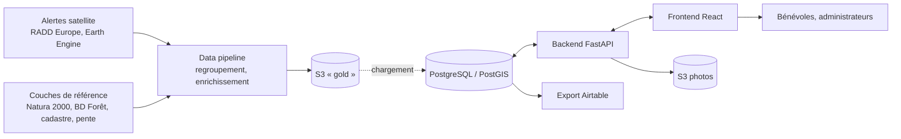
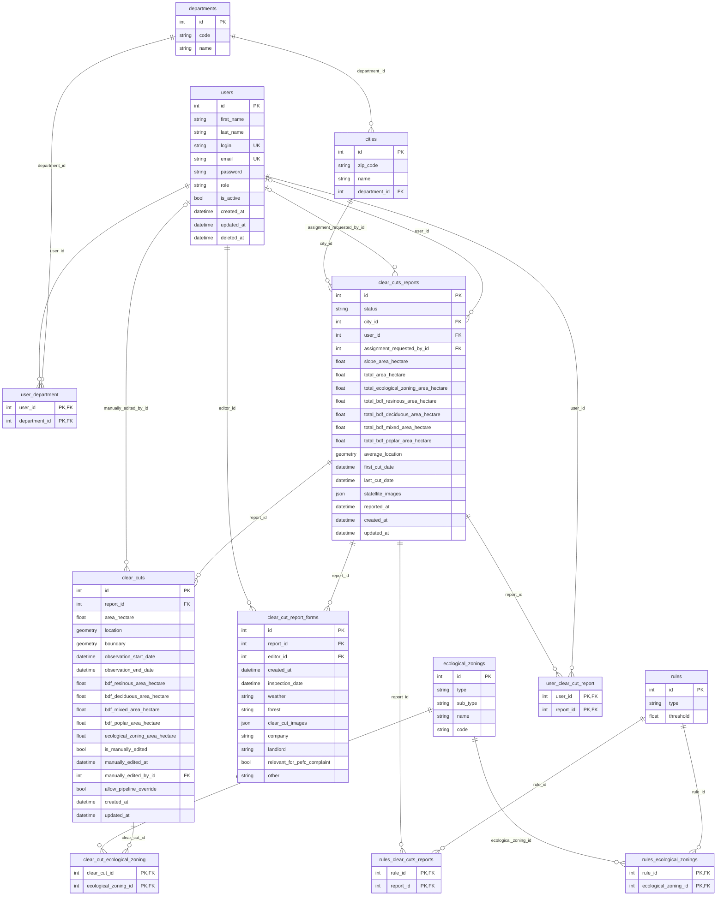
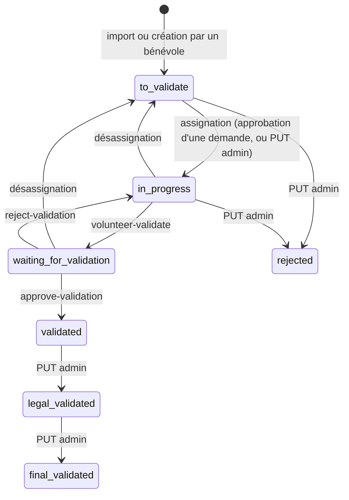

# Architecture et domaine métier

Ce document décrit ce qu'il faut connaître avant de modifier le code, quel que soit le sous-projet : le vocabulaire, le modèle de données, le cycle de vie d'un signalement, les rôles, puis l'organisation du backend et du frontend. Pour installer et lancer le projet, voir le [README](../README.md).

## Vue d'ensemble

```mermaid
flowchart LR
    RADD[Alertes satellite<br>RADD Europe, Earth Engine] --> P[Data pipeline<br>regroupement, enrichissement]
    REF[Couches de référence<br>Natura 2000, BD Forêt, cadastre, pente] --> P
    P --> S3[(S3 « gold »)]
    S3 -. chargement .-> DB[(PostgreSQL / PostGIS)]
    DB <--> API[Backend FastAPI]
    API <--> FRONT[Frontend React]
    FRONT --> V[Bénévoles, administrateurs]
    API --> PHOTOS[(S3 photos)]
    DB --> AT[Export Airtable]
```

- La **data pipeline** ne connaît que les coupes : elle lit la base pour savoir jusqu'où elle a déjà traité, et publie ses résultats dans S3 ([data_pipeline/pipeline/README.md](../data_pipeline/pipeline/README.md)).
- Le **backend** possède la base : modèles, migrations, règles d'illégalité, workflow, authentification.
- Le **frontend** est une SPA qui ne parle qu'à l'API ; il fonctionne aussi sur des données simulées (`pnpm dev:mock`).

## Glossaire

| Terme | Dans le code | Définition |
|---|---|---|
| Polygone | — (pipeline) | Une détection satellite unitaire, datée. Plusieurs millions depuis 2018 ; jamais stockés en base. |
| Coupe rase, *clear cut* | `ClearCut`, table `clear_cuts` | Regroupement de polygones proches dans l'espace (< 100 m) et dans le temps (< 1 an). Porte la géométrie, la surface, les dates d'observation et les surfaces par type de forêt (BD Forêt) et en zonage écologique. |
| Signalement, *clear cut report* | `ClearCutReport`, table `clear_cuts_reports` | Entité suivie par les bénévoles : une ou plusieurs coupes rases, une commune, un statut, un bénévole assigné. Les totaux (surface, dates, localisation moyenne) sont recalculés à partir des coupes. |
| Formulaire, *form* | `ClearCutForm`, table `clear_cut_report_forms` | Constat de terrain rempli par un bénévole pour un signalement. Chaque enregistrement est une **version** : l'historique est conservé, la dernière fait foi. Champs décrits dans [clear-cut-description.md](./clear-cut-description.md). |
| Zonage écologique | `EcologicalZoning` | Zone protégée (Natura 2000…) intersectant une coupe. |
| Règle | `Rules` | Seuil au-delà duquel un signalement est suspect : surface, pente, zonage écologique. |
| Département, commune | `Department`, `City` | Référentiel géographique ; un bénévole est rattaché à un ou plusieurs départements. |

Les regroupements et leur datation sont détaillés dans [pipeline_dataeng.md](./pipeline_dataeng.md).

## Modèle de données

Diagramme généré depuis `backend/app/models.py` avec `make erd` dans `backend/` ; le régénérer après une migration. La table des formulaires est abrégée.

```mermaid
erDiagram
    departments {
        int id PK
        string code
        string name
    }
    cities {
        int id PK
        string zip_code
        string name
        int department_id FK
    }
    users {
        int id PK
        string first_name
        string last_name
        string login UK
        string email UK
        string password
        string role
        bool is_active
        datetime created_at
        datetime updated_at
        datetime deleted_at
    }
    user_department {
        int user_id PK,FK
        int department_id PK,FK
    }
    clear_cuts_reports {
        int id PK
        string status
        int city_id FK
        int user_id FK
        int assignment_requested_by_id FK
        float slope_area_hectare
        float total_area_hectare
        float total_ecological_zoning_area_hectare
        float total_bdf_resinous_area_hectare
        float total_bdf_deciduous_area_hectare
        float total_bdf_mixed_area_hectare
        float total_bdf_poplar_area_hectare
        geometry average_location
        datetime first_cut_date
        datetime last_cut_date
        json statellite_images
        datetime reported_at
        datetime created_at
        datetime updated_at
    }
    clear_cuts {
        int id PK
        int report_id FK
        float area_hectare
        geometry location
        geometry boundary
        datetime observation_start_date
        datetime observation_end_date
        float bdf_resinous_area_hectare
        float bdf_deciduous_area_hectare
        float bdf_mixed_area_hectare
        float bdf_poplar_area_hectare
        float ecological_zoning_area_hectare
        bool is_manually_edited
        datetime manually_edited_at
        int manually_edited_by_id FK
        bool allow_pipeline_override
        datetime created_at
        datetime updated_at
    }
    clear_cut_report_forms {
        int id PK
        int report_id FK
        int editor_id FK
        datetime created_at
        datetime inspection_date
        string weather
        string forest
        json clear_cut_images
        string company
        string landlord
        bool relevant_for_pefc_complaint
        string other
    }
    ecological_zonings {
        int id PK
        string type
        string sub_type
        string name
        string code
    }
    clear_cut_ecological_zoning {
        int clear_cut_id PK,FK
        int ecological_zoning_id PK,FK
    }
    rules {
        int id PK
        string type
        float threshold
    }
    rules_ecological_zonings {
        int rule_id PK,FK
        int ecological_zoning_id PK,FK
    }
    rules_clear_cuts_reports {
        int rule_id PK,FK
        int report_id PK,FK
    }
    user_clear_cut_report {
        int user_id PK,FK
        int report_id PK,FK
    }
    departments ||--o{ cities : department_id
    departments ||--o{ user_department : department_id
    users ||--o{ user_department : user_id
    users |o--o{ clear_cuts_reports : user_id
    users |o--o{ clear_cuts_reports : assignment_requested_by_id
    cities ||--o{ clear_cuts_reports : city_id
    clear_cuts_reports ||--o{ clear_cuts : report_id
    users |o--o{ clear_cuts : manually_edited_by_id
    clear_cuts_reports ||--o{ clear_cut_report_forms : report_id
    users ||--o{ clear_cut_report_forms : editor_id
    clear_cuts ||--o{ clear_cut_ecological_zoning : clear_cut_id
    ecological_zonings ||--o{ clear_cut_ecological_zoning : ecological_zoning_id
    rules ||--o{ rules_ecological_zonings : rule_id
    ecological_zonings ||--o{ rules_ecological_zonings : ecological_zoning_id
    rules ||--o{ rules_clear_cuts_reports : rule_id
    clear_cuts_reports ||--o{ rules_clear_cuts_reports : report_id
    users ||--o{ user_clear_cut_report : user_id
    clear_cuts_reports ||--o{ user_clear_cut_report : report_id
```

Toutes les géométries sont en WGS 84 (SRID 4326) ; l'API expose les coordonnées en `latitude/longitude`. Voir [intro-to-postgis.md](./intro-to-postgis.md).

### Règles d'illégalité

Trois règles, une ligne chacune dans `rules`, modifiables par un administrateur (page Administration) :

| Type | Un signalement est marqué si… | Seuil initial |
|---|---|---|
| `area` | sa surface totale ≥ seuil (hectares) | 10 |
| `slope` | sa surface en forte pente ≥ seuil (hectares) | 2 |
| `ecological_zoning` | sa surface dans l'un des zonages sélectionnés ≥ seuil (hectares) | 0,5 |

Les règles déclenchées sont stockées dans `rules_clear_cuts_reports` par `sync_clear_cuts_reports` (`backend/app/services/clear_cut_report.py`), qui recalcule aussi les totaux de chaque signalement à partir de ses coupes. Cette synchronisation tourne après le seed et après tout changement de règle.

## Cycle de vie d'un signalement

Un signalement porte deux informations distinctes : son **statut** (`status`) et son **titulaire** (`user_id`, le bénévole qui remplit le formulaire). Une demande d'assignation en attente est stockée à part (`assignment_requested_by_id`) et ne change pas le statut.

```mermaid
stateDiagram-v2
    [*] --> to_validate : import ou création par un bénévole
    to_validate --> in_progress : assignation (approbation d'une demande, ou PUT admin)
    in_progress --> to_validate : désassignation
    in_progress --> waiting_for_validation : volunteer-validate
    waiting_for_validation --> to_validate : désassignation
    waiting_for_validation --> in_progress : reject-validation
    waiting_for_validation --> validated : approve-validation
    validated --> legal_validated : PUT admin
    legal_validated --> final_validated : PUT admin
    to_validate --> rejected : PUT admin
    in_progress --> rejected : PUT admin
```

| Statut | Libellé | Sens |
|---|---|---|
| `to_validate` | À valider | Nouveau, sans titulaire. |
| `in_progress` | En traitement | Un bénévole est titulaire et remplit le formulaire. |
| `waiting_for_validation` | En attente de validation | Le bénévole a terminé ; un administrateur doit relire. |
| `validated`, `legal_validated`, `final_validated` | Validé, validé juridiquement, validé définitivement | Étapes de validation par les administrateurs. |
| `rejected` | Rejeté | Faux positif ou sans suite. |

Un signalement sans titulaire n'est jamais `in_progress` ni `waiting_for_validation` : l'assignation et la désassignation passent toutes par `assign_report` / `unassign_report` (`services/clear_cut_report.py`), quel que soit le chemin.

- **Assigner** : pose le titulaire, efface la demande en attente et fait passer un signalement `to_validate` en `in_progress`. Un autre statut est conservé (réassigner un signalement validé ne le rouvre pas).
- **Désassigner** : retire le titulaire et remet un signalement `in_progress` ou `waiting_for_validation` en `to_validate`. Un statut décidé par un administrateur (`validated` et suivants, `rejected`) est conservé.

### Actions du workflow

Toutes les transitions « métier » passent par une route unique, `POST /api/v1/clear-cuts-reports/{id}/{action}`. Chaque action est déclarée une fois dans `backend/app/services/report_workflow.py` (`TRANSITIONS`) : qui peut la déclencher, ce qui doit être vrai du signalement, ce qu'elle modifie, l'e-mail envoyé ensuite.

| Action | Qui | Condition | Effet | E-mail |
|---|---|---|---|---|
| `request-assignment` | tout utilisateur connecté | statut `to_validate`, pas de titulaire, pas de demande en attente | la demande est posée à son nom | — |
| `cancel-request` | l'auteur de la demande | — | la demande est effacée | — |
| `approve-assignment` | admin | une demande en attente | assignation au demandeur | au nouveau titulaire |
| `reject-assignment` | admin | une demande en attente | la demande est effacée | — |
| `unassign` | le titulaire ou un admin | — | désassignation | — |
| `volunteer-validate` | le titulaire ou un admin | statut `in_progress` | → `waiting_for_validation` | — |
| `approve-validation` | admin | statut `waiting_for_validation` | → `validated` | — |
| `reject-validation` | admin | statut `waiting_for_validation` | → `in_progress`, le titulaire reste | au titulaire |

Refus : `403 FORBIDDEN` pour un droit manquant, `400` (`ALREADY_ASSIGNED`, `REQUEST_PENDING`, `NO_REQUEST`, `INVALID_STATUS`) quand le signalement n'est pas dans le bon état, `404` s'il n'existe pas.

### Modification directe (`PUT /api/v1/clear-cuts-reports/{id}`)

- **Administrateur** : peut assigner (`userId`) ou désassigner (`userId: null`) avec les mêmes effets que ci-dessus, et fixer n'importe quel statut (`status`) sans contrôle de transition. C'est le seul chemin vers `legal_validated`, `final_validated` et `rejected`.
- **Bénévole** : ne peut que libérer son propre signalement (`userId: null`). S'attribuer un signalement (`403 INVALID_REQUESTER_RIGHTS`) ou changer un statut (`403`) lui est refusé ; libérer celui d'un autre renvoie `409 ALREADY_ASSIGNED`.

### Formulaire

Un bénévole peut remplir le formulaire s'il est titulaire, ou s'il a une demande d'assignation en attente sur un signalement sans titulaire (il peut commencer avant l'approbation). Sinon : `403 NOT_ASSIGNED`.

Le formulaire est **verrouillé pour les bénévoles** (`403 FORM_LOCKED`) dans les statuts `waiting_for_validation`, `validated`, `legal_validated`, `final_validated` et `rejected`. Un administrateur peut toujours l'éditer. Après un `reject-validation`, le signalement revient en `in_progress` et le titulaire peut de nouveau modifier son formulaire.

Un bénévole peut aussi **créer** un signalement depuis la carte (polygone dessiné) : il naît en `to_validate` avec la demande d'assignation déjà posée à son nom.

### Versions du formulaire et conflits

Chaque enregistrement (`POST /{id}/forms`) crée une nouvelle version. Le client envoie l'ETag de la version qu'il a chargée ; si le serveur en a une plus récente, il répond `409 ETAG_MISMATCH` et le frontend propose de comparer `original` (version chargée), `current` (édition locale) et `latest` (serveur). Le brouillon est conservé dans `localStorage` pour reprendre l'édition hors connexion.

## Rôles

| | Bénévole (`volunteer`) | Administrateur (`admin`) |
|---|---|---|
| Voir la carte et les signalements | oui | oui |
| Demander une assignation, se désassigner | ses signalements | tous |
| Remplir le formulaire | s'il est titulaire (ou demandeur en attente) et que le statut n'est pas verrouillé | toujours |
| Soumettre à validation | ses signalements `in_progress` | tous |
| Approuver / refuser assignation et validation, changer un statut | non | oui |
| Gérer les utilisateurs, les départements, les règles | non | oui |

Un compte désactivé (`is_active = false`) ou supprimé (`deleted_at`) ne peut plus se connecter ni rafraîchir de jeton.

Authentification : JWT HS256 signés avec `JWT_SECRET_KEY` — jeton d'accès 60 minutes, jeton de rafraîchissement 7 jours, jeton de réinitialisation de mot de passe 1 heure. Les e-mails partent par SMTP (`services/email.py`, variables `SMTP_*`) ; sans `SMTP_HOST`, ils sont seulement écrits dans les logs.

## Backend

`backend/app/`, FastAPI + SQLAlchemy 2 + GeoAlchemy2, migrations Alembic.

| Module | Rôle |
|---|---|
| `main.py` | Crée l'application, CORS, enregistre les routeurs. |
| `config.py` | `Settings` (pydantic-settings), voir les variables dans [backend/README.md](../backend/README.md). |
| `database.py`, `deps.py` | Session SQLAlchemy et dépendances FastAPI (`db_session`, `get_current_user`). |
| `models.py` | Tous les modèles ORM, dans un seul fichier. |
| `routes/` | Un fichier par ressource sous `/api/v1/` ; handlers minces qui vérifient les droits et appellent les services. |
| `services/` | Logique métier et requêtes : `clear_cut_report.py` (sync, règles, assignation), `report_workflow.py` (actions du workflow), `clear_cut_form.py` (versions, verrouillage, ETag), `clear_cut_map.py` (carte et filtres), `user_auth.py` (jetons), `images.py` / `s3.py` (photos, S3 ou repli local signé). |
| `schemas/` | Modèles Pydantic d'entrée et de sortie. |

`seed_dev.py` construit le jeu de données de développement (quatre départements réels, comptes, signalements couvrant chaque statut) ; `seed_prd.py` ne crée que le référentiel et les règles. Après un changement de `models.py` : `make generate-migration` puis relire la migration.

Tests : `test/unit/` sans base, le reste avec la base `test` migrée (fixture `db`, réinitialisée à chaque test). Couverture minimale 70 % (`make test`).

## Frontend

`frontend/src/`, React 19 + TypeScript, Vite, TanStack Router (routes par fichier), Redux Toolkit, Tailwind, Leaflet, Biome.

| Dossier | Rôle |
|---|---|
| `routes/` | Arbre de routes TanStack : carte et liste (`_clear-cuts.*`), fiche (`$clearCutId`), `my-cuts`, `administration`, connexion et mot de passe. |
| `features/clear-cut/` | Carte, liste, fiche et formulaire ; `store/clear-cuts-slice.ts` (état, thunks, sélecteurs), `store/clear-cuts.ts` (schémas Zod et types), `store/status.ts` (libellés et couleurs des statuts), `store/filters.slice.ts`. |
| `features/admin/` | Utilisateurs, règles. |
| `features/user/` | Authentification, profil, « mes coupes ». |
| `features/offline/` | Hook de mise à jour de la PWA. |
| `shared/api/` | Client HTTP `ky`, injection et rafraîchissement du jeton, erreurs typées. |
| `shared/store/` | Store, `thunk.ts` (helpers), `referential/` (départements, zonages, règles, chargés une fois). |
| `components/ui/`, `shared/components/`, `shared/form/` | Primitives shadcn/ui, mise en page et composants partagés, champs de formulaire. |
| `mocks/` | Handlers MSW pour `pnpm dev:mock` et les tests navigateur. |

Convention d'état : chaque appel asynchrone est un `createAppAsyncThunk` et son résultat un `RequestedContent<T>` (`{ status: "idle" | "pending" | "success" | "error", value?, error? }`) branché sur le slice par `addRequestedContentCases`. Les composants lisent l'état par des sélecteurs et affichent selon `status` ; pas d'appel HTTP hors des thunks.

Tests : `*.test.ts` (Vitest, logique pure) et `*.browser.test.tsx` (Vitest browser mode, Playwright/Chromium, composants sur MSW). Storybook publie les composants sur GitHub Pages.

## Data pipeline

Voir [data_pipeline/README.md](../data_pipeline/README.md) pour les trois sous-projets et [pipeline_dataeng.md](./pipeline_dataeng.md) pour les étapes et le vocabulaire côté données.
