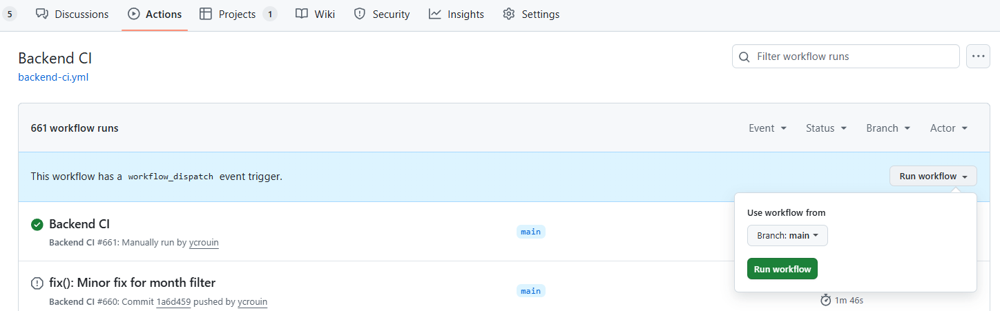
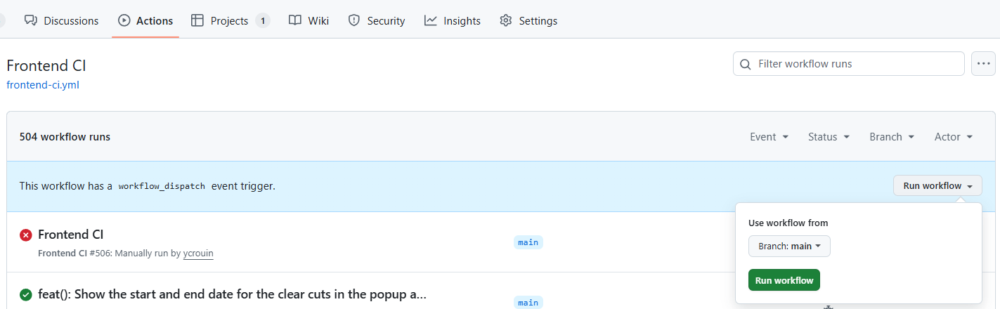
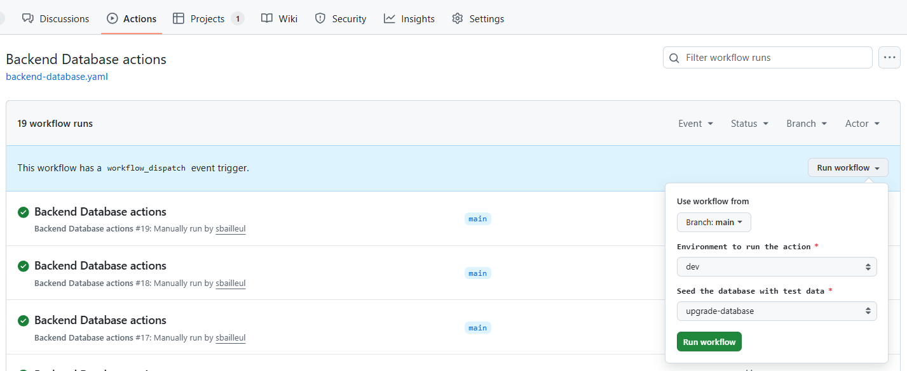

# Déploiement et opérations

Mise en production, workflows GitHub Actions et manipulations du bucket S3. Pour installer le projet en local, voir le [README](../README.md).

## Branches et déploiement

Les pull requests visent `main`. Fusionner n'entraîne aucun déploiement : la mise en production se fait en publiant une [release GitHub](https://github.com/dataforgoodfr/13_brigade_coupes_rases/releases/new) avec un tag `vX.Y.Z` (bouton « Generate release notes » pour lister les pull requests fusionnées). Le workflow **Release** déploie alors le backend et le frontend sur Clever Cloud. Une release marquée « pre-release » n'est pas déployée.

Avant de publier `vX.Y.Z`, fusionner une pull request qui porte la version `X.Y.Z` dans `frontend/package.json`, `backend/pyproject.toml` et `data_pipeline/pyproject.toml` : le workflow Release refuse de déployer si une des trois ne correspond pas au tag. L'API annonce la version de `backend/pyproject.toml` (OpenAPI).

Pour revenir à une version antérieure, lancer le workflow Release à la main (onglet Actions, « Run workflow ») en indiquant le tag à redéployer.

Le Storybook est publié sur GitHub Pages à chaque modification du frontend sur `main`.

## Data pipeline et synchronisation Airtable

La data pipeline est une application Docker distincte sur Clever Cloud (`CC_DOCKERFILE=data_pipeline/Dockerfile`, contexte de build à la racine du dépôt), déclarée comme tâche ([Clever Tasks](https://www.clever.cloud/developers/doc/develop/tasks/)) : chaque démarrage exécute la pipeline une fois, puis l'instance s'arrête. Aucun workflow ne la déploie, elle se met à jour depuis la console ou avec `clever deploy`.

Le workflow **Pipeline mensuelle** (`pipeline-mensuelle.yml`) la redémarre le 2 de chaque mois ; il peut aussi être lancé à la main. Le chargement en base dépend de la variable `LOAD_DATABASE` de l'application (`off`, `dry-run` ou `on`, voir [data_pipeline/.env.example](../data_pipeline/.env.example)). Le suivi d'une exécution se fait dans les journaux de l'application Clever. La synchronisation Airtable tourne dans GitHub Actions (`airtable-sync.yml`, deux fois par jour).

## Workflows GitHub Actions

Les workflows peuvent aussi être lancés à la main depuis l'onglet Actions (bouton « Run workflow »).

**Backend CI** : tests du backend (pytest, mypy).



**Frontend CI** : lint, tests unitaires et navigateur (Playwright).



**Database Actions** : actions manuelles sur la base (upgrade, setup, reset).



## Bucket S3

```bash
# Lister les fichiers
aws s3 ls s3://brigade-coupe-rase-s3 --recursive --profile d4g-s13-brigade-coupes-rases

# Supprimer les fichiers de développement
aws s3 rm s3://brigade-coupe-rase-s3/development/reports/ --recursive --profile d4g-s13-brigade-coupes-rases

# Mettre à jour la configuration CORS (fichier dans frontend/s3cors.json)
aws s3api put-bucket-cors --bucket brigade-coupe-rase-s3 --cors-configuration file://frontend/s3cors.json --profile d4g-s13-brigade-coupes-rases
```
